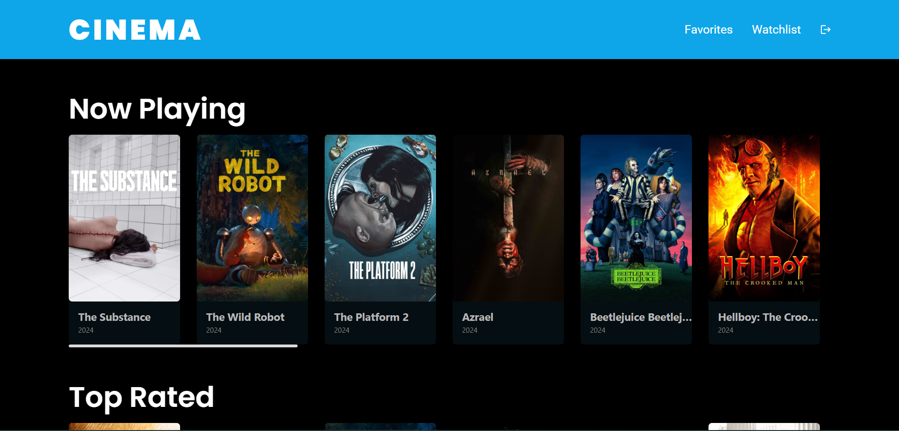

# Movie Web App - Seryu Cargo Coding Test

React web application that allow to explore information about movie from TMDB.

## Feature

- Browse now playing, and top rated movies.
- View detailed information about a movie.
- Save your favorite and watchlist movies.

## Screenshot



## TechStack

- React
- TMDB API
- Vite
- React Router
- React icons
- TailwindCSS

## Installation

### Clone the repository

```bash
git clone https://github.com/mirfanwebdev/mirfan-page.git
cd seryu-cargo-test
```

### Install dependencies

```bash
npm install
```

### Run development server

```bash
npm run dev
```
